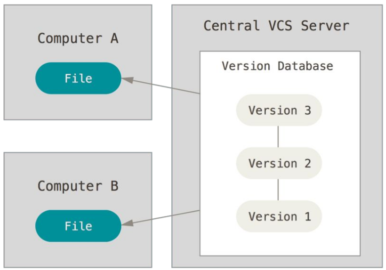
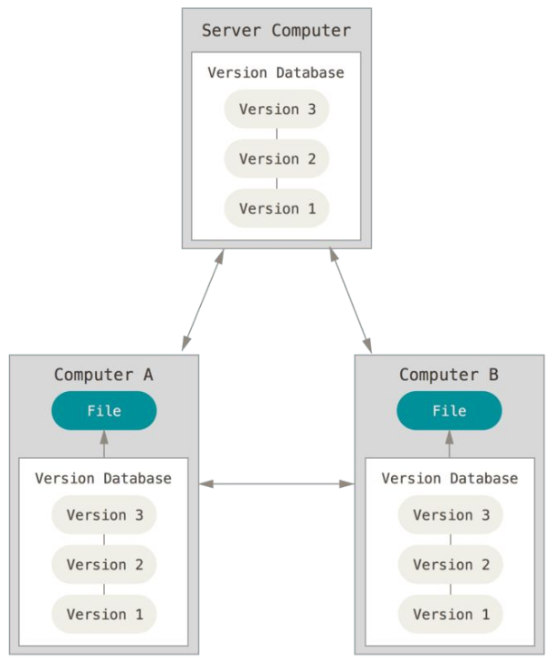
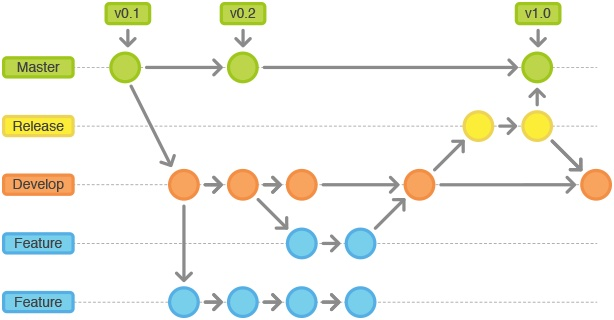
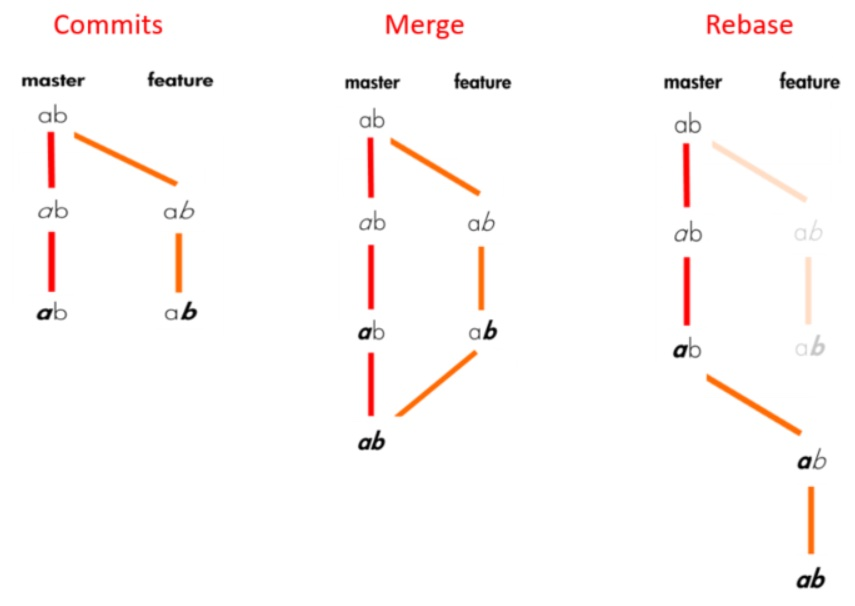

# Source Control Management (SCM)

Source control management (or an interchangeable term "version control") has made a surge of collaborative work and software delivery increasingly rapid. It is now standard in software development to maintain a single source of truth for development teams, which allows multiple developers to work on the same codebase. Git, as a leader outclassing other SCM tools, is obligatory to be mastered for everyone involved in software development processes.

Source control management (SCM) refers to tools that help you keep track of your code with a complete history of changes.

## Why SCM?

- How to share the work?
- How to keep track of changes and their authors?

## History

- The concept started with engineering   
  **Drawing and project offices evolved a robust system for dealing with engineering processes and thus were born the fledgling change control and release systems.**
- Modern implementation in software development since ~1980
- Git started in 2005

## What do you manage?

- Code, or any **text-based** projects (like all the configurations needed for the project)
- Manage project versions
  - Global project version (tags)
  - Each modification is a «version»
- Change requests

## SCM types

### Centralized

  - has a single central repository
  - single point of failure
  - requires a network to inspect a history
  
**Examples:** Tortoise SVN

### Distributed

  - local repository with full history
  - independent work

**Examples:** Git, Mercurial SCM

## Git: concepts

Learn git - https://git-scm.com/doc

- **Git Project**
- Each set of changes to files are **commits**
- Each commit has a **parent commit** (except for the first one)
- The current commit is the **HEAD**
- The git project is kept in a remote location - **repository**
- Retrieving changes from the repo is **pulling**
- Sending changes to the repo is **pushing**
- When choosing what to commit, files are **staged**

## Git: branches

- **Branches** - independent set of commits
- So far all commits are on the **master** branch
- Branch can be an abstraction for a line of development
  - **master** is the stable, tested version of the project
  - **develop** is the place where features come together
  - **feature** is the branch for a single feature

A branch can be temporary:
  - To have a change request
  - To develop an independent feature
    

- Create branches or switch between them with `git branch`

## Git: tags

So far:

- changes are managed, not the project
- all the commits come one after the other
- the only version available in the commit id

**Tagging** versions:

- Tag a **commit** to be a particular software version
- It easier to identify the versions
- You have to **push** the tags

## Git: merge & conflicts

- Branches can be merged to have all the changes in only one branch
- When multiple changes conflict with each other, the merge fails: `Automatic merge failed; fix conflicts and then commit the result.`
- Solutions:
  - Cherrypick the changes (can be quite long)
  - Abandon your changes (and put them back later)
  - Work on the latest commit (git pull) and have a good task repartition

## Git: merge vs rebase

Read this [article on Medium](https://medium.com/datadriveninvestor/git-rebase-vs-merge-cc5199edd77c).

## OpenSource Project Management

- Code managed by git, how can people contribute?
- **Fork** the project on your account
- Work on a change on your fork
- Ask for your changes to be added to the official code - [pull request](https://help.github.com/en/github/collaborating-with-issues-and-pull-requests/about-pull-requests)

## Project management with GitLab

Provides from basic issue tracking to scrum and kanban style

- Track and manage issues 
- Issue boards to visualize work
- Agile project management
- DevOps pipeline traceability

[Read more about GitLab project management](https://about.gitlab.com/solutions/project-management/).

## Git Flow branching strategies

- Git Flow
- GitHub Flow
- GitLab Flow
- One Flow

[Read more](https://medium.com/@patrickporto/4-branching-workflows-for-git-30d0aaee7bf)
