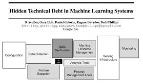
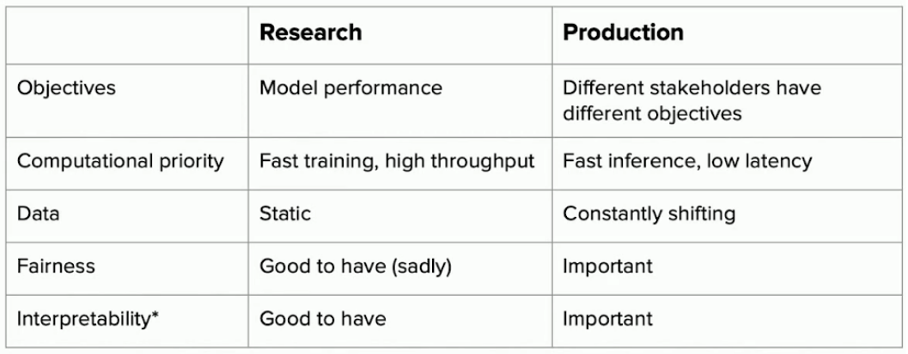
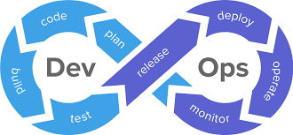
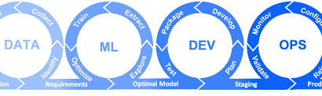
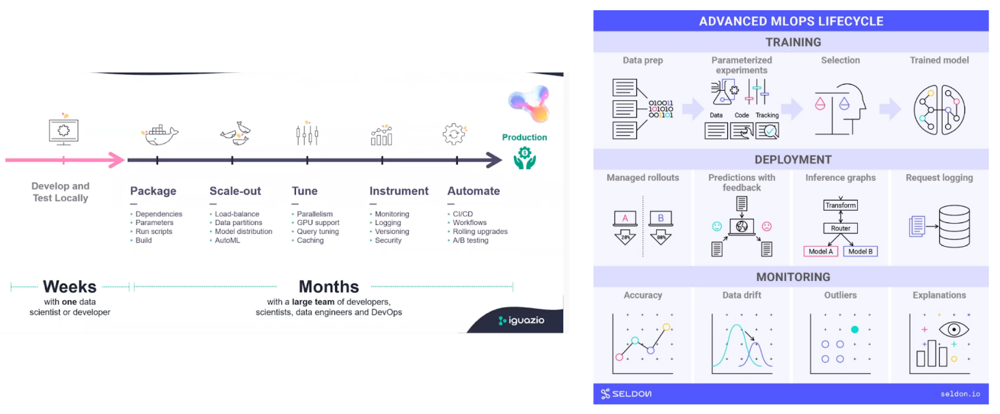
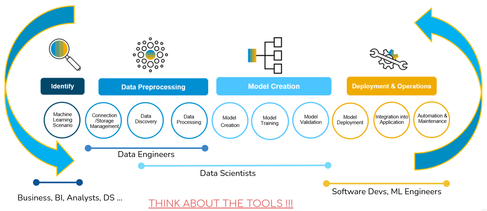
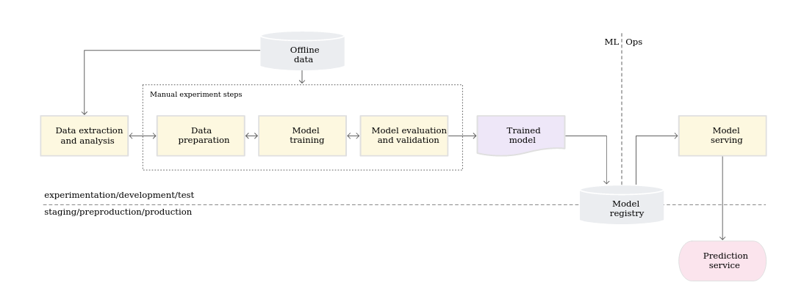
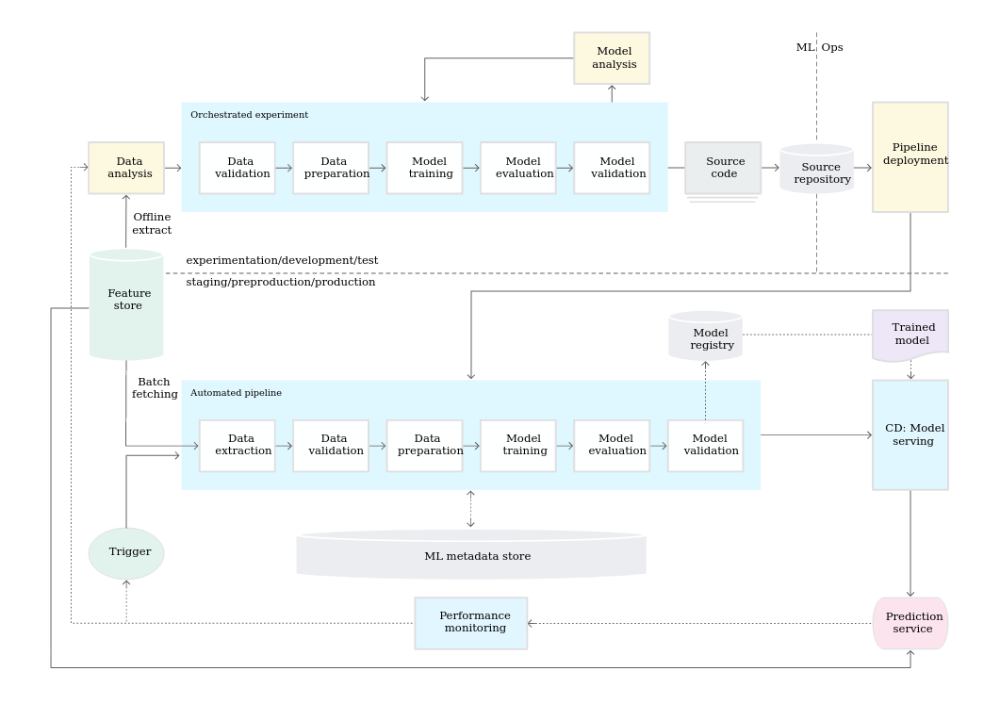
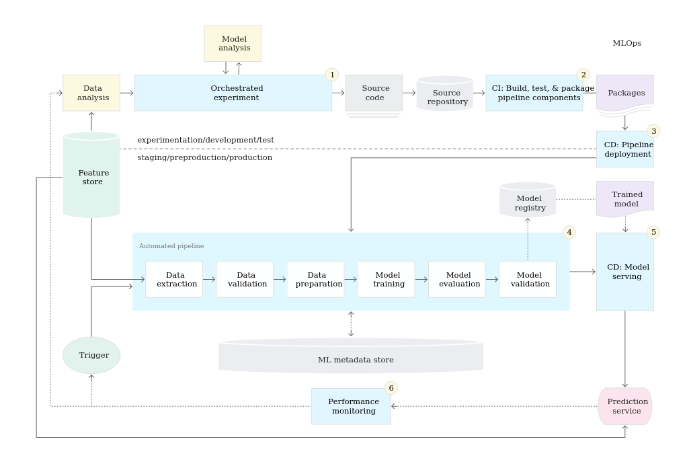

# Introduction to MLOps

## Motivation

- A lot of MLOps skills implement good practice (versioning, testing…)
  - -> increase the **quality** and the **reproducibility** of work
- **High in-demand skills!**
- To avoid the following situations:

## What does it do?

- Brings ML models to production
- Automates individual repetitive steps
- QC/QA

### Why is it important?

- **Only models in production bring added value to the business**
- Data Scientists are not final users
- A lot of tasks are manual but repetitive (data ingestion, model re-training), which is waist of time
- Brings good practices to daily work

### But...

- 80% of the models are never deployed
- Developing a model takes weeks/months, deploying takes months/year(s)

## Data science landscape

Data science is much more than just machine learning!

[Reference](https://proceedings.neurips.cc/paper/2015/file/86df7dcfd896fcaf2674f757a2463eba-Paper.pdf)

## ML in research vs. production

[Reference](https://www.youtube.com/watch?v=g08qBcdk3Ss)

## Challenges of deploying ML

[Reference](https://arxiv.org/pdf/2011.09926.pdf)

### Software is being deployed all the time, so what's the big deal?

Let’s start with analogy in software development -> **DevOps**

## What is DevOps?

- **It’s a culture**
- It encourages automation
- It strives to deliver the results quickly

### DevOps Principles (Software development)

- **Version Control**. Developers submit code changes to a central repository several times a day. Prior to submitting code to the master repository (master branch), all code must be verified. To facilitate collaboration, other developers can track changes.
- **Continuous Integration**. Members of the development team integrate their code in a shared repository, several times a day. Each developer segments the work into small, manageable chunks of code and detects potential merge conflicts and bugs quicker.
- **Continuous Delivery**. As the code is continuously integrated, it is also consistently delivered to the end-user. Smaller contributions allow faster update releases, which is a crucial factor for customer satisfaction.
- **Continuous Deployment**. A big part of DevOps is automating processes to speed up production. Continuous deployment involves automating releases of minor updates that do not pose a substantial threat to the existing architecture.
- **Continuous Testing**. Such a strategy involves testing as much as possible in every step of development. Automated tests give valuable feedback and a risk assessment of the process at hand.
- **Continuous Operations**. The DevOps team is always working on upgrading software with small but frequent releases. That is why DevOps requires constant monitoring of performance. Its main goal is to prevent downtime and availability issues during code release.
- **Collaboration**. One of the main goals of DevOps is to foster collaboration and feedback sharing. Development and Operations need to proactively communicate and share feedback to maintain an efficient DevOps pipeline.

## MLOps = DevOps for ML

### MLOps Principles

- Replace `code` in DevOps principles with `code + model + data` -> MLOps
- Some might be less impacted (CI/CD)
- Some heavily increase in complexity due to `model + data` part: versioning, testing, operations (performance monitoring)
- Additional one: **Model feedback**. Saving incoming data and predictions once a model is deployed.

## DevOps vs MLOps

- With DevOps, we deploy:
  - code (app)
- With MLOps, we deploy:
  - code (data pre-processing, feature engineering)
  - model
  - sometimes data (aggregates)
  - we actually deploy a **pipeline**

[Reference](https://www.youtube.com/watch?v=pqppGvTJm-A)

## Different tasks (and definitions) of MLOps

[Reference](https://www.youtube.com/watch?v=VCUDo9umKEQ)

## ML Lifecycle and Roles

## Tools

## Maturity levels of MLOps systems (according to Google)

- Level 0 - manual
- Level 1 - ML pipeline automation
- Level 2 - CI/CD pipeline automation

[Reference](https://cloud.google.com/architecture/mlops-continuous-delivery-and-automation-pipelines-in-machine-learning)

### Level 0: manual process

- Data scientists and Ops teams are **separated**
- Only **the model** is served (not the whole pipeline)
- Model is not frequently updated
- No monitoring

### Level 1: ML pipeline automation

- The goal is CT in production when **new data** becomes available
- We need to deploy the **whole pipeline** (data+model)
- The steps need to be automated and orchestrated
- Code is reproducible and modular

Need of additional components:

- Triggers - to trigger the re-training
- Feature store - stores pre-computed features that model uses during serving
- Metadata store - execution logs

### Level 2: CI/CD pipeline automation

- Automatically build, test, and deploy the new pipeline components to the target environment
- Deployment:
  - Automated - to the test environment
  - Semi-automated - to pre-production (triggered by merge)
  - Manual - to production

## How does it work in real life?

- Depends a lot on the skills and experience of the group
- Depends a lot on the number of models to deploy/maintain
- Depends on how often we need to retrain the model

Generally:
- Starting with the simplest system  
- Gradual improvements: automation of critical steps, adding tests, adding model monitoring...
