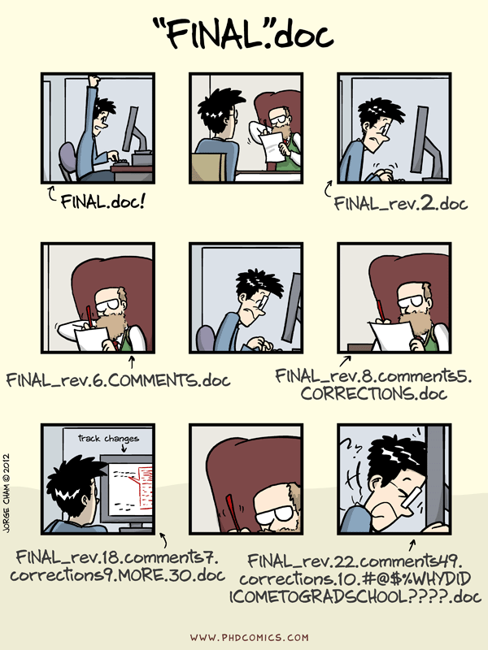
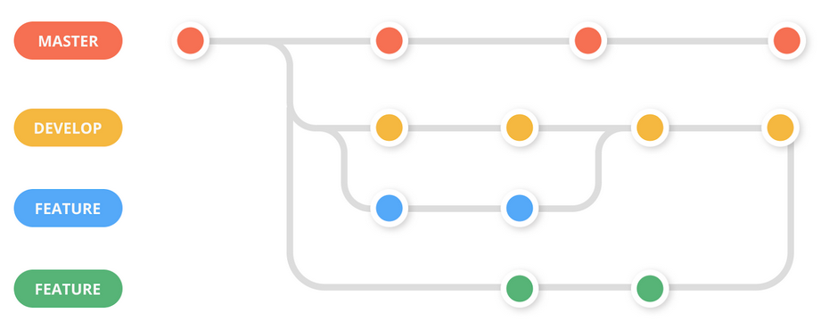
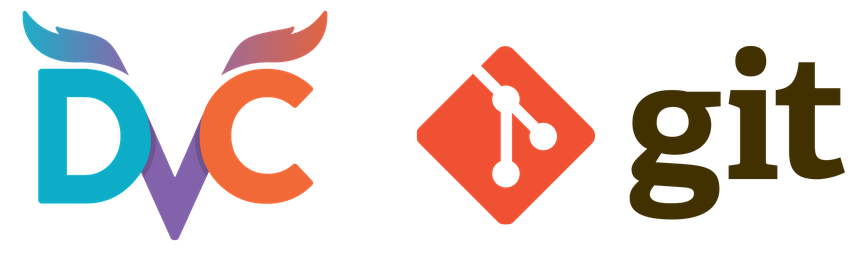
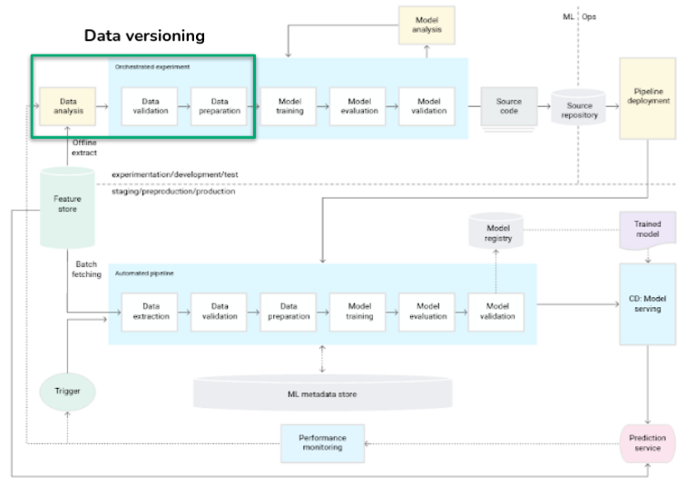
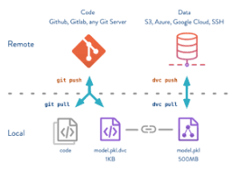
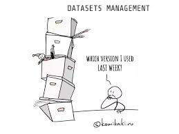
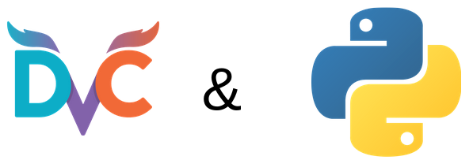
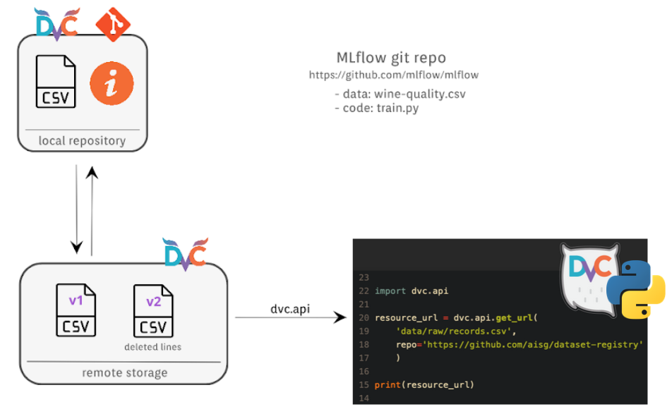

# Reproducible Data Science: Data Versioning

# Git refresher

## Why do we need version control?

## Git basics

### What is Git?

- **Git**: Distributed Version Control System
- **Git repository**:
  - A directory of versioned files => saves the history of all changes
  - It exists as a local copy with “.git” at the root of the project
  - The user can decide which files to version (.gitignore file)
- **Providers**: GitHub, GitLab; self-managed

[Reference](https://git-scm.com/book/en/v2/Getting-Started-About-Version-Control)

### Data flow

### Git workflow

Typical branch organization:

[Reference](https://www.atlassian.com/git/tutorials/comparing-workflows/gitflow-workflow)

## Data versioning

[DVC official site](https://dvc.org/)

### Roadmap

### Problem definition

What do we need to track in Data Science project to be able to reproduce the results?

- **Dataset**:
  - Tabular
  - Images, video, sound, text
- **Code**:
  - Functionality, Hyper-parameters
  - Data pre-processing, Modeling
- **Results**:
  - Numeric (metrics)
  - Plots
- **Environment**:
  - Dependencies

### Data versioning use cases

Data beyond data science:

- **Data engineering** during data cleaning and dataset preparation
- Test data in **software engineering** to assure the functionality of the software
- Development and testing of **database applications**
- Ontology versioning for **Semantic Web**
- ...

### Data is in the heart of any ML project

Why is the exact version of a dataset important?

- Data quality management
- Reproducible training and re-training
- Automation of testing or deployment
- Use in applications and web services
- Audit

### Classical data versioning solutions and their downsides

Classical Software Engineering tools are not enough to solve ML reproducibility crisis.

- **Git**:
  - Not suitable for big files
  - Difficulties with binary files
- **Git-LFS**:
  - File size limitation (ex.: 2 GB for GitHub free account and 5 GB for GitHub Enterprise Cloud)
  - Data needs to be stored on servers of Git provider
- **External storage**:
  - Checksum calculation for any change in the dataset and placing them under version control
  - Consistency!!!

### What is DVC?

- Tracks **datasets** and **ML projects**
- Works with many types of **storages** (cloud, local, HDFS, HTTP…)
- Runs on top of **Git**
- Supports building and running **pipelines**

We will focus on dataset tracking (versioning).

### The exact version of the dataset can be extracted in through the API

- **DVC**:
  - Solves Git's limitation of the file sizes
  - Easy to learn (for Git users)
  - Contains Python API
- **Python**:
  - Widely used
  - Can access a specific version of a dataset directly through the DVC's Python API

### Practical example

