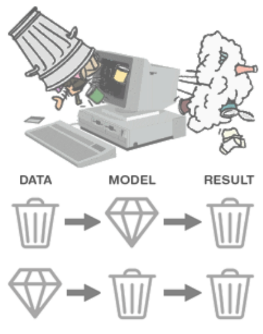
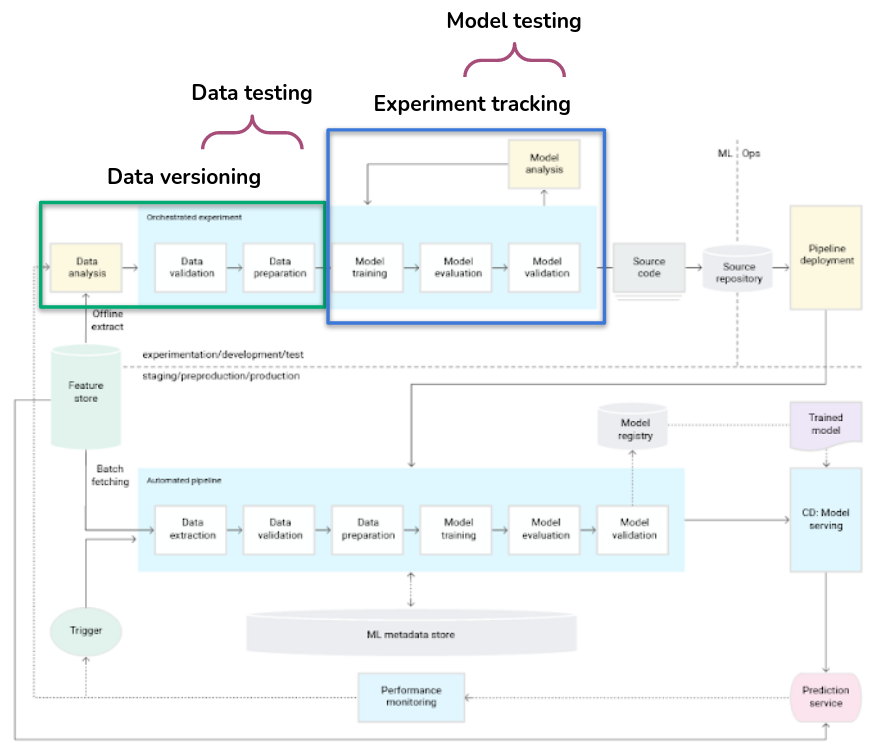
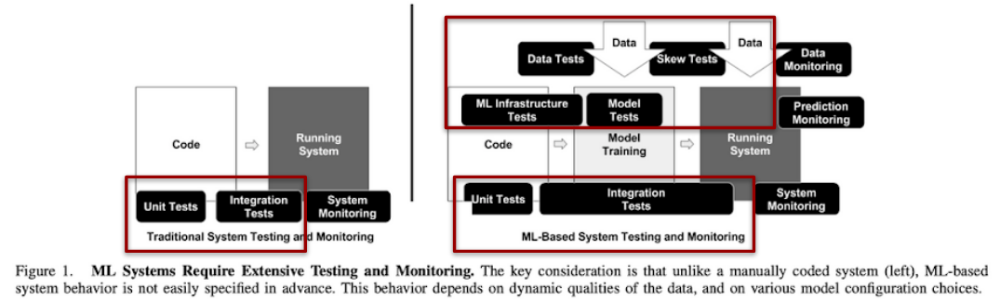
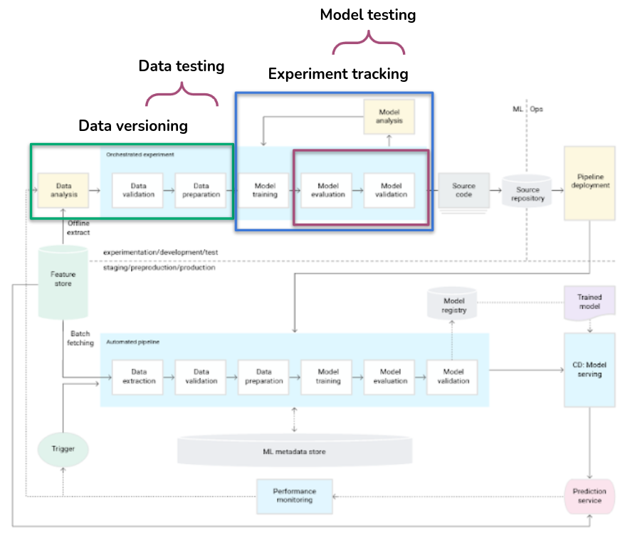
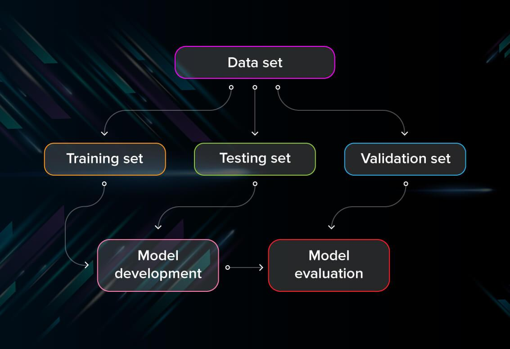
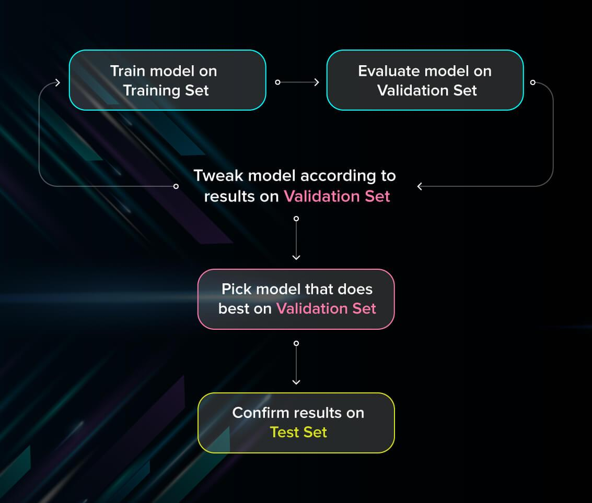
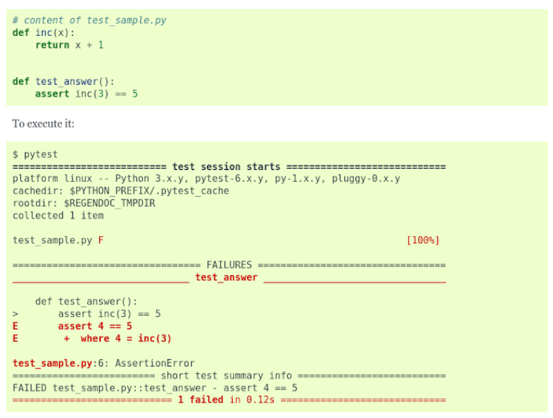

# Testing

## Extension of 'Garbage in, garbage out' to ML systems

## Roadmap

## Tests everywhere...

[Resource](https://research.google/pubs/pub46555/)

## ... but every test has its time

[Resource](https://martinfowler.com/articles/cd4ml.html)

## ML pipeline testing

- Goals of **software testing**:
  - Catch bugs early on
  - Assure that the software is behaving according to the requirements

**BUT**: behavior of the model is data-dependent and is based on learning (it’s not hard-coded)!

- Addition for **ML systems**:
  - The behavior needs to remain consistent during many calls
    - Non-deterministic algorithms (deep learning)

## Model testing

### Model evaluation

- Evaluate the capabilities of generalization (usual practice):
  - Cross-validation
  - Choose appropriate metric
- Good practice: split your dataset on **3 sets** (not on 2 which you always see in class!)

[Resource](https://serokell.io/blog/machine-learning-testing)

### Model validation

- **Logic of the algorithm** - do we always test it? (output length, range, intended overfitting…)
- Compare to a **baseline model** (better than random?)
- **Invariance tests** - how much we can change the input without it affecting the performance of the model. For example, if we run a pattern recognition model on two different photos of red apples, we expect that the result will not change much.
- **Directional expectation** tests - how perturbations in input will change the behavior of the model. For example, when building a regression model that estimates the prices of houses and takes square meters as one of the parameters, we want to see that adding extra space makes the price go up.
- **Minimum functionality** tests - test the components of the program separately just like traditional unit tests. For example, you can assess the model on specific cases found in your data.

[Resource](https://serokell.io/blog/machine-learning-testing)

### Data testing

- Raw data:
  - Null values: not allowed in target column
  - Schema
  - Range: outliers
  - Text: special symbols, capitalized letters
  - NLP: Content, language
- => **corrections** before non-conform data enters the pipeline and breaks it

- Processed data:
  - Distribution/range of engineered features
  - Normalization: range 0-1
  - Standardization: mean approx. 0
- => **correctness** of the transformations

### Training-serving skew

- After the test-train split
- Data for the training is not representative
  - Missing categories
  - Different ranges of numeric variables
  - Different quality of images or sound

## Tools

- Data:
  - Advanced data testing framework: [Great Expectations](https://greatexpectations.io/)
  - Generating synthetic data: [Trumania](https://github.com/RealImpactAnalytics/trumania) (and many others)
- Coding (unit testing):
  - [PyTest](https://docs.pytest.org)
  - [unittest](https://docs.python.org/3/library/unittest.html)
  - ...

## PyTest

[Reference](https://docs.pytest.org/en/6.2.x/)
