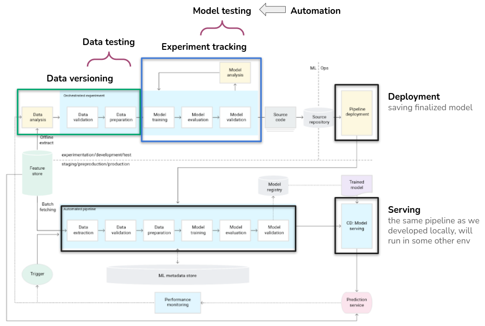
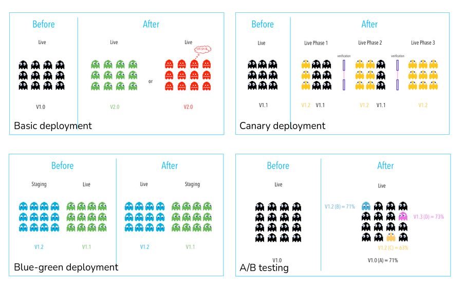
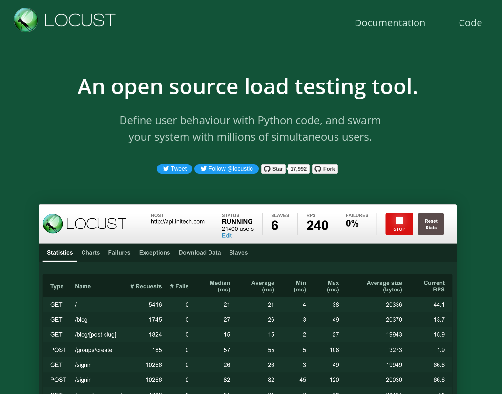

# Deployment

## Motivation

- End-users can (finally) use it for inference
- We start generating value from all the hard work

## Roadmap

## Vocabulary

- **Delivery**: a step before deployment. The model is all ready, just waiting to be deployed.
- **Deployment**: integrating a new model into existing environment. It doesn’t need to be in interaction with end-users.
- **Serving**: a model put in disposition to end-users.
- **Release**: when we say a version of a service is released, we mean that it is responsible for serving production traffic. In verb form, releasing is the process of moving production traffic to the new version.

## Deployment targets

- Microservices with a REST API to serve online predictions.
- An embedded model to an edge or mobile device.
- Part of a batch prediction system.

## Latency constraints

- Batch predictions
- Real-time predictions

## Deployment strategies

[Reference](https://harness.io/blog/continuous-verification/blue-green-canary-deployment-strategies/)

## Tests after deployment

[Locust official site](https://locust.io/)
