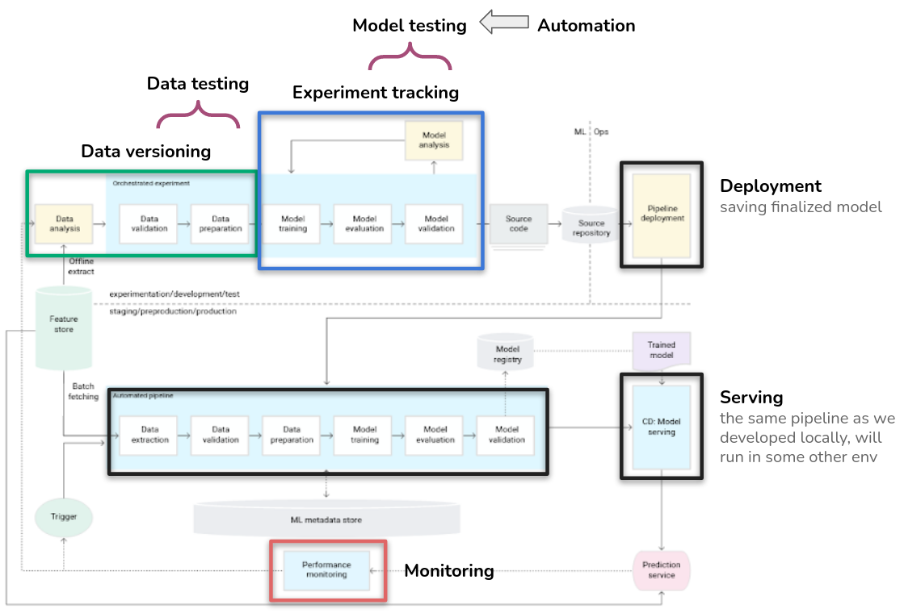
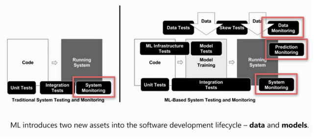
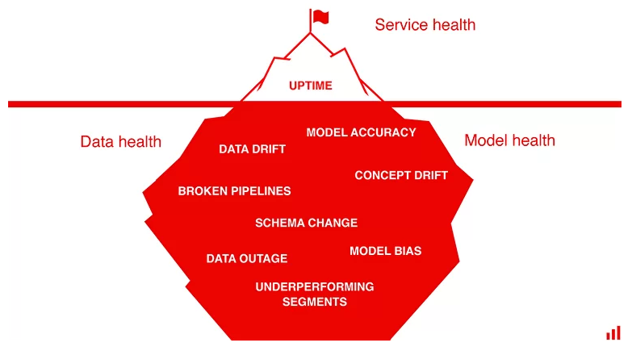
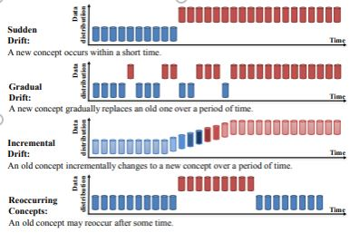
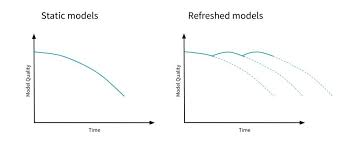

# Monitoring

## Motivation

- The model is in production
- We tested it thoroughly before deployment
- What can go wrong?

***“Model starts degrading immediately after we put in production.”***

## Roadmap

## Do you remember?

- ML in production: infra + data (pipelines) + model (pipelines)
- Things can go wrong on every step => **there’s so many steps**

[Reference](https://www.kdnuggets.com/2021/01/mlops-model-monitoring-101.html)

## Extra layer of complexity

- Many failures will be silent
- You want to discover potential problems before the end-users do

[Reference](https://evidentlyai.com/blog/machine-learning-monitoring-what-it-is-and-how-it-differs)

## System monitoring

- resource utilization (RAM, CPU, disk)
- latency
- uptime
- ...

## Data monitoring

### Issues

How can data change with time?

- **Quality** issues:
  - Features (or data providers) can be discontinued
    - Change on the web page
    - Stop buying data from a specific provider
  - Content and/or type of the feature changes
    - From age to age group
  - Data get anonymized
    - GDPR
- **Content** issues:
  - Distribution changes
    - The data we had for development was not representative
    - Changes on the market (competition, Covid, crisis, trends…)

### Data quality control

- Schema (e.g. age as numerical value becomes categorical (20-30y, 30-40y...))
- Missing values (e.g. discontinued columns)
- Change in number of categories (e.g. non-binary gender)
- Change in naming of categories (e.g. male/female -> M/F)
- Range (outliers)
- ...

### Data content control

- When we can think of a dataset, we can imagine two different categories of the data:
  - Target variable
  - Everything else
- According to this properties we separate two categories of issues
  - **Data drift**: change in the distribution of the variables
  - **Concept (target) drift**: the statistical properties of the target variable change over time; business problem changes
    - *Gradual*:
      - Consequence of evolution/adaptation
      - Normal and expected
      - Examples:
        - Competitors launch new products. Consumers have more choices, and their behavior changes. As should sales forecasting models.
        - Macroeconomic conditions evolve. As some borrowers default on their loans, the credit risk is redefined. Scoring models need to learn it.
        - Mechanical wear of equipment. Under the same process parameters, the patterns are now slightly different. It affects quality prediction models in manufacturing.
    - *Sudden*:
      - Drastic changes in short time
      - Examples:
        - Epidemy, crisis
        - Change in the interest rate by the central bank. All financial and investment behavior is affected, and models fail to adapt to unseen patterns.
        - Technical revamp of the production line. Predictive maintenance becomes obsolete since modified equipment has new failure modes (or lack of those).
        - Major update in the app interface. Past data on clicks and conversion becomes irrelevant since the user journey is a new one.

**Data drift:**

**Concept drift:**

## Model decay

- All data issues lead to worse performance of the model  => staleness, model decay
- Control: The predictions are compared to the ground truth and the performance is estimated

[Reference](https://evidentlyai.com/blog/machine-learning-monitoring-data-and-concept-drift)

## What to do with stale models?

Model needs to learn new state of the world:

- Retrain
- Build new model

Problems:

- When is ‘bad behavior’ bad enough?
- Is enough data available?
- What are new underlying rules?

[Further reading on retraining](https://evidentlyai.com/blog/retrain-or-not-retrain)
